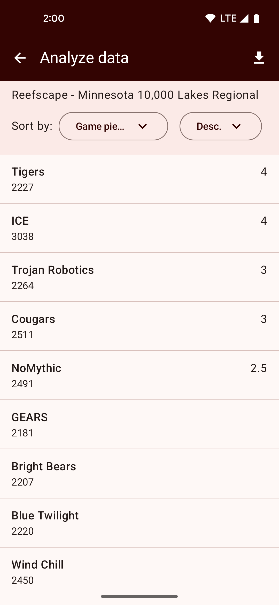
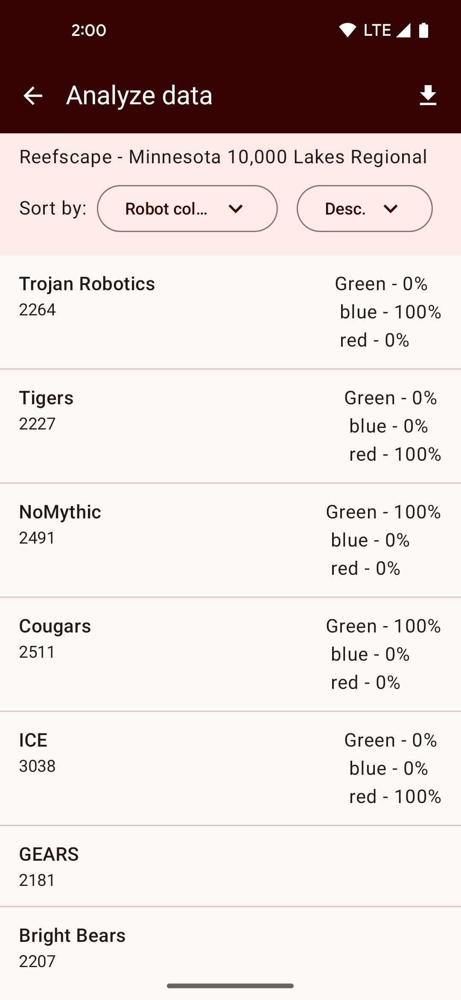
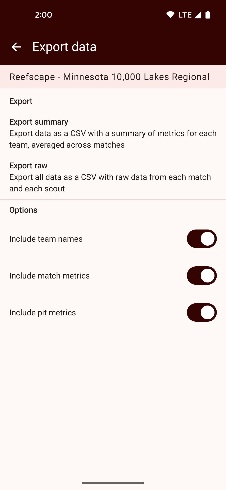

# Exporting & analyzing data

The "Analyze data" option on the home screen gives you access to view data locally or export it
for further analysis on another device.

## Analyzing on-device

FRC Krawler allows you to do some basic data analysis directly on your device. You can choose a 
single metric to sort by, and view a summary of each team's data for that metric. 

Some metrics such as counters, sliders, and booleans will display an average value, while other
metrics such as choosers and checkboxes will display a percentage of how often each value was chosen.

Text field data is not available to view on-device.

{: style="height:500px"}
{: style="height:500px"}

## Exporting data
Tap the download button from the analyze data screen to export your data.

You can choose whether to create a raw export with every saved piece of data for each metric, or a 
summary export that includes average values (for numeric data) and percentages for option-based metrics.

You can also choose whether to include team names in the report, and whether you want to export match 
metrics, pit metrics, or both.

{: style="height:500px"}