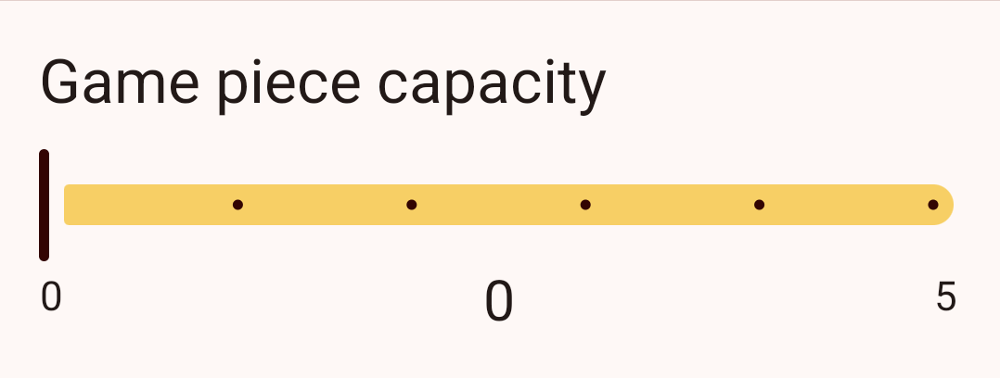
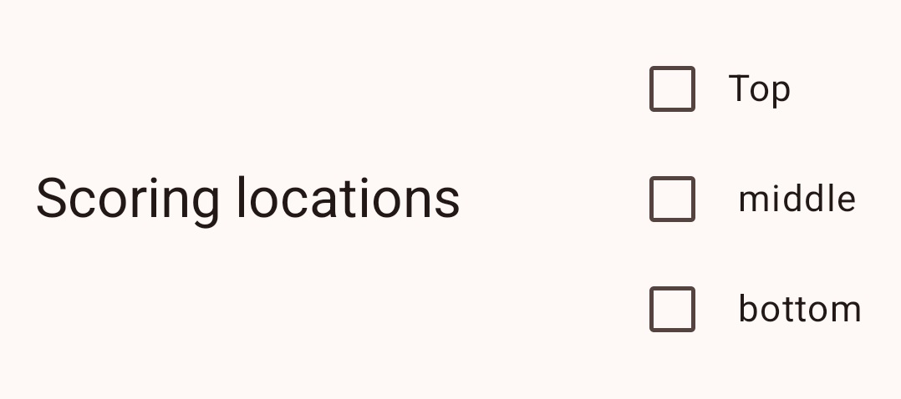

# Metric types
FRC Krawler offers a variety of metric types to help you gather the data that's important to 
making quality alliance selection decisions in a way that is easy for your scouts to use.

When adding or editing metrics you have access to an interactive preview to understand how each 
metric will show up during scouting.

Here is a list of metric types and a brief description of each:

## Boolean

A boolean metric creates a simple on/off toggle and is represented in exported data as either 
`true` or `false`.

## Slider

A slider metric creates a horizontal slider with a minumum and maximum value. Slider data will
export as a number.

## Counter

Counter metrics display as a number with "-" and "+" buttons to decrement or increment the count.
Counter data will export as a number.

Unlike sliders, counters can also have a "step size" to support incremening by larger ammounts with
each tap.

## Chooser

Choosers allow scouts to select a single option from a predefined list of options. When setting 
up a chooser you define the possible options using a comma-separated list of values. Exported
data will be a string with the selected option.

## Checkbox

A checkbox is very similar to a chooser, but they support selecting zero, one, or many options (whereas
sliders only allow selecting a single option). Exported data will a comma-separated list of selected options.

## Stopwatch

Stopwatches allow scouts to time events during a match. Stopwatches can be started, paused, and reset.
Exported data will contain the the elapsed time with a single decimal place of precision (e.g. `12.3`).

## Text field

Text fields support free-form text input. They are particularly useful for qualitative data such as
commentary that may not otherwise fit into another metric type.

## Section header

Section headers are non-interactive text labels that you can use to help organize your scouting
forms. They will not be represented in exported data.