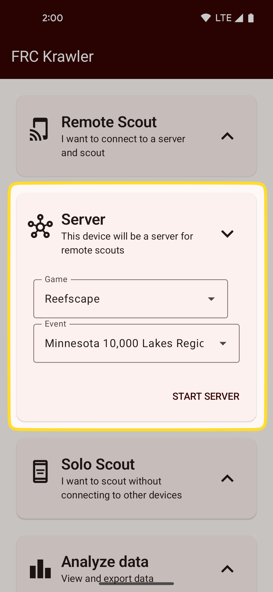
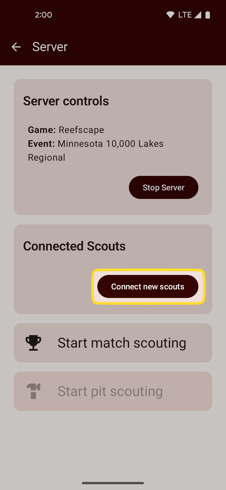
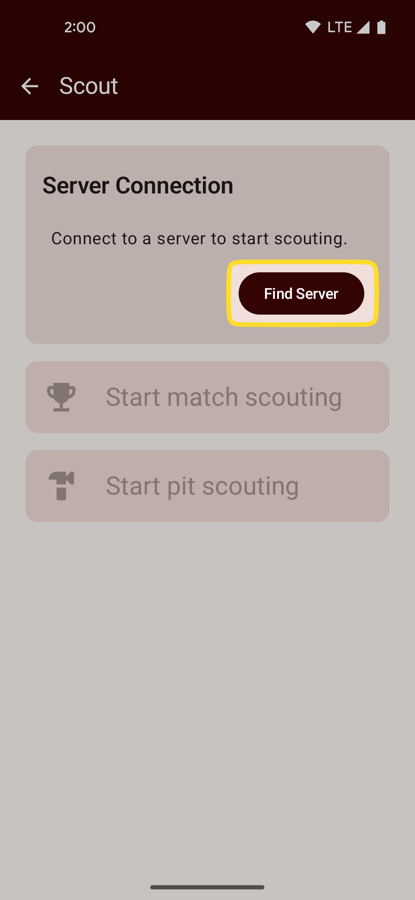
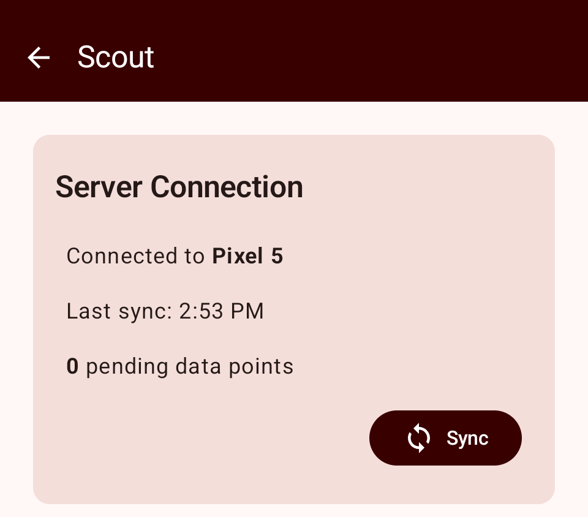

# Scouting with a server
You can use FRC Krawler in a multi-device setup where one device acts as a server and other devices
(scouts) sync the game, event, and metrics configuration from a server and send back collected data.

Before remote scouting, you must [setup at least one game, event, and metric set](setup.md) **on 
the server device**.

## Setting up the server

Tap the "server" card on the home screen to expand the server options.
Select which game and event you want to scout, choose whether you want to do match or pit scouting,
then hit "start server".

{: style="height:500px"}

Once you are on the server screen, you will see the server configuration at the top of the screen.
Tapping "start server" will start running the background server process and allow bluetooth connetions
to your device.

## Connecting new scout devices
Once the server is running, connect your scout devices.

**On the server device:** click "connect new scouts" to allow new bluetooth connections. Your device will
now be discoverable over bluetooth for 60 seconds.

{: style="height:500px"}

**On the scout device:"** Tap the "remote scout" card on the home screen to navigate to the remote 
scouting screen. Tap "find server"

{: style="height:500px"}

Select your server device from the list of available Bluetooth devices.

## Connecting previously connected scouts
If you've previously connected a scout, you **do not** need to click "connect new scouts" on the server.
From the remote scout device, simply enter remote scouting and tap "find server" to reconnect.

## Initial data sync
Once you have connected a remote scout, you will see it appear on the server in the list of 
connected scouts, along with the time of the last sync from that device.

On the scout device you will see information on the server you are connected to, including the device 
name, last sync time, and how many pieces of data are waiting to be synced.

Upon connecting to a server, the scout and server devices will sync the game, event, and metric 
configuration.

!!! Warning

Be sure to periodically tap the "sync" button on each scout to send collected data back to the server!

## Next: Scouting
See [scouting](scouting.md) for details on entering data while scouting.