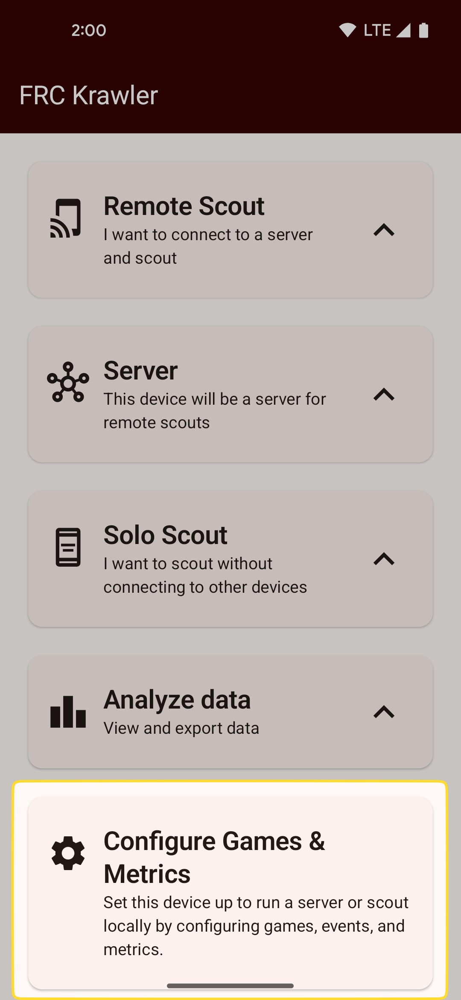
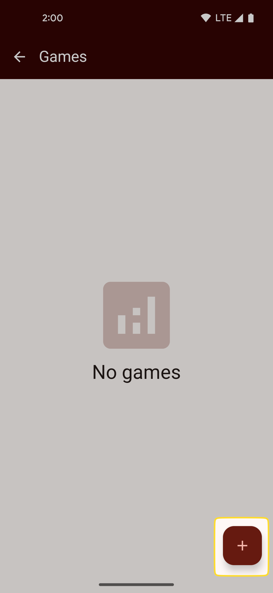
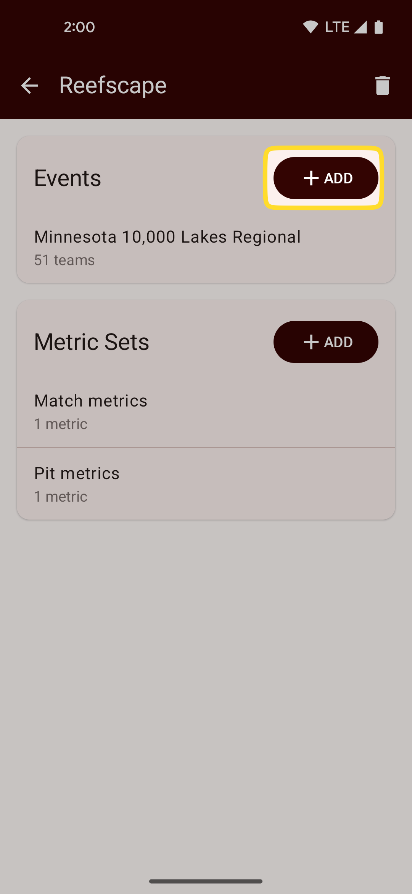
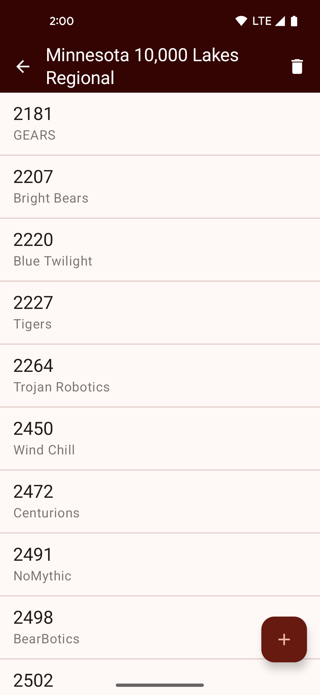
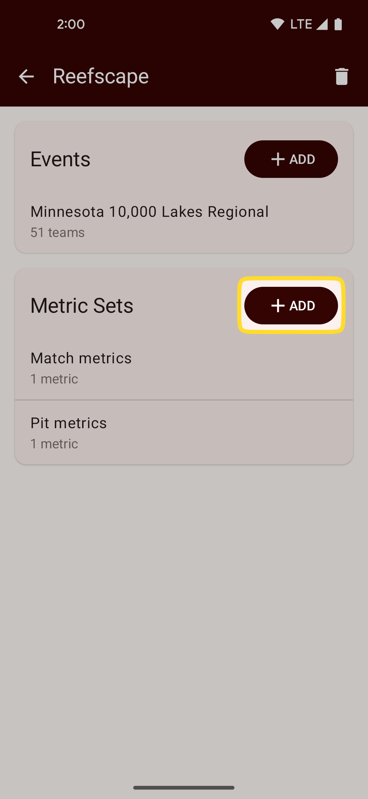
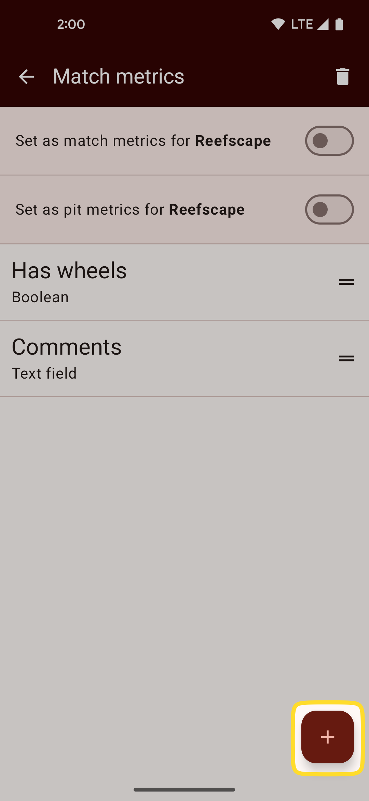
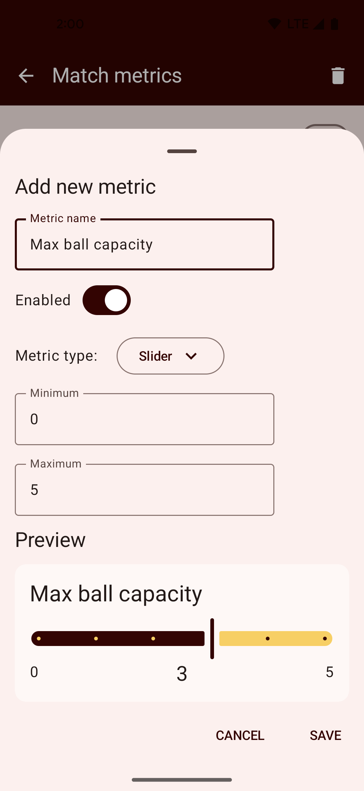

# Setup
## Installing the app
[Head over to the Google Play Store](https://play.google.com/store/apps/details?id=com.team2052.frckrawler) to install FRC Krawler on your device.

If your device does not have access to the Google Play Store you can also [download the latest release 
from GitHub](https://github.com/frc2052/FRC-Krawler/releases) and install using the [Android Debug Bridge (ADB)](https://developer.android.com/tools/adb).

## Choose how you want to use FRC Krawler
FRC Krawler supports two primary approaches to scouting:
 * **Single device scouting** where all scouting happens on a single device
 * **Server & remote scouting** where one Android device acts as a server and scouts use one or more other devices to scout and sync their data back to the server

Regardless of which option you choose, the next steps **only need to be completed on one device**.
That device is the server in a multi-device setup, and all the scout devices will download the configuration 
from that server.

## Add a game
From the home screen, tap the "Configure Games & Metrics" card, then tap the "+" button to add a new game.
Choose a name for your game and tap "save".

{: style="height:500px"}
{: style="height:500px"}

## Add an event and teams
You must have at least one event configured to begin scouting.

Tap on a game in the list of games to open the game configuration screen.
Tap on "add" next to the event list to add a new event.

You can choose to either:
 * **Automatically add an event** (requires an internet connection): this will allow you to select an event from The Blue Alliance and automatically download a list of attending teams
 * **Manually add an event**: For events that are not listed on The Blue Alliance (or if you don't have an internet connection), you can manually enter an event name

Once you have added an event, tap it on the event list to view the list of attending teams. From 
here you can manually add additional teams or edit team names and numbers if necessary.

{: style="height:500px"}
{: style="height:500px"}

## Add metric sets
You need a least one "metric set" to begin scouting. A metric set is a collection of metrics that 
you want to scout, and can be assigned as either the "match metrics" for a game, or as the 
"pit metrics" for a game.

From the game configuration screen, tap "add" on the metric sets list to create a new metric set.
Give your metric set a name and tap "save".

{: style="height:500px"}

## Add metrics
Each metric set you create will start with only a single default metric - a "comments" text field.

Tap on a metric set to configure the metrics in that set.

You can add a new metric by clicking the "+" button, or edit an existing metric by tapping on it 
in the list. The add/edit metric sheet allows you to:
 * Set a name for the metric
 * Enable or disbable the metric
 * Choose the type of metric (see [metric types](metric-types.md))
 * Configure options specific to each metric type (e.g. a minimum or maximum value for a counter)
 * Preview the metric

Once you have added a metric you can either grab the "handle" on the right side of the screen or 
long press and drag a metric to reorder the list.

{: style="height:500px"}
{: style="height:500px"}

## Start scouting
Congratulations, you are now ready to start scouting!

See [scouting with a server](scouting-with-server.md) or [solo scouting](solo-scouting.md) to 
begin collecting data.