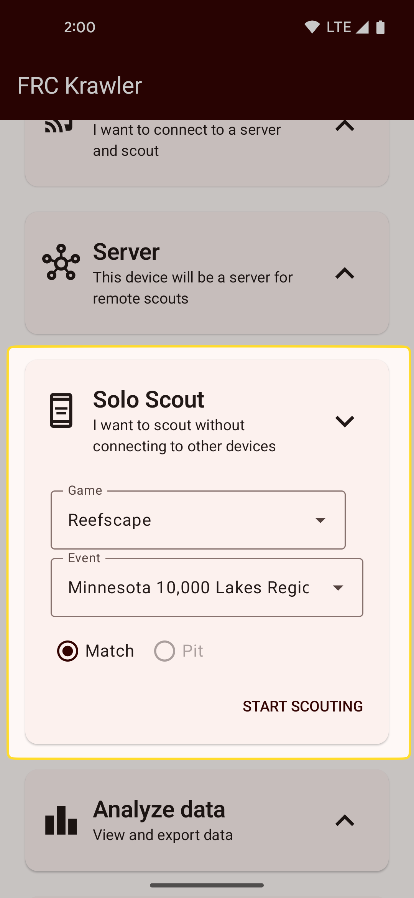

# Solo scouting
The "solo scout" mode allows you to scout using a single device. 
Before solo scouting, you must [setup at least one game, event, and metric set](setup.md).

Tap the "solo scout" card on the home screen to expand the solo scouting options.
Select which game and event you want to scout, choose whether you want to do match or pit scouting, 
then hit "start scouting"!

{: style="height:500px"}

## Next: Scouting
See [scouting](scouting.md) for details on entering data while scouting.